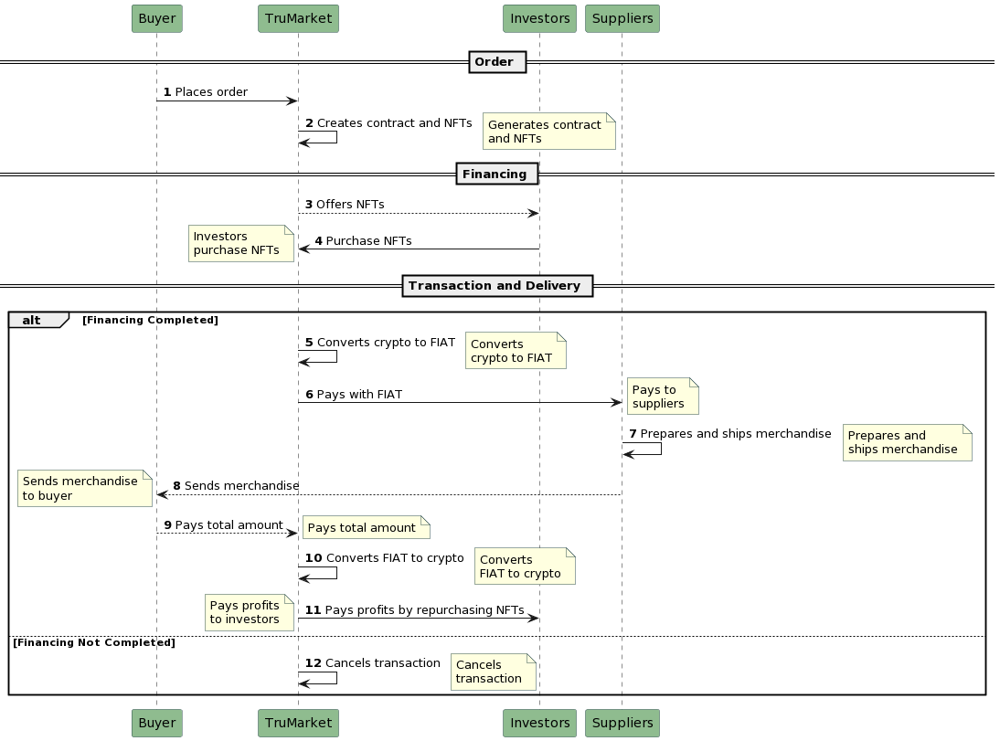

----->>>> Tasks

Client:
- Dashboard de Admin con todos las colecciones de NFTs
- Enviar a dicho dashboard luego de efectuar la creacion de una colección
- Dashboard de Inversores 

Blockchain:
- Evaluar si mintear todos los NFT al contrato o dejar los minteos a cada inversor

# TruMarket Project

Tru Market is a blockchain-based platform that connects local producers with global buyers, ensuring transparency and trust in the value chain from farm to table.

## Mission

TruMarket's mission is to enable complete traceability in global supply chains using blockchain and smart contracts. This provides customers with a transparent view of product origin, journey, and quality while creating opportunities for sustainable practices among suppliers.

### Smart Contracts

Smart contracts secure agreements between parties in a tamper-proof manner, executing terms encoded in a blockchain network, including payments.

### Operations and Quality Control

Every operation undergoes real-time inspection, with quality control shared among stakeholders and accessible from any device.

### Consumer Access

Consumers can access public data by scanning smart labels to understand a product's history.

## Factory Contract

The Factory contract is Upgradeable and creates ERC1155 contracts using the FactoryFunc() function.

### Key Functions

- `FactoryFunc()`: Creates contracts with specific parameters and stores relevant information.
- `getAddresses()`: Returns an array with addresses of each contract.

## FinancingContract1155

This contract is ERC1155 and offers several features and functions.

### Key Variables

- `amountToFinance`
- `investmentFractions`
- `fractionPrice`
- `buyBackPrice`
- `withdraw`
- `USDT usdt`

### Key Functions

- `BuyFraction(uint256 _amount)`: Enables purchase of fractions with rigorous checks.
- `setBuyBack(uint256 profit)`: Sets profits and changes contract state.
- `withdrawBuyBack()`: Allows profit withdrawal and burning of NFT tokens.
- `withdrawUSDT()`: Admin method to withdraw USDT.

### Structures and Mappings

- `HistoryFractions`: Custom record of purchased fractions.
- Mappings for balances, investor IDs, amounts, and states.

### Events

- `Invest`
- `TotalAmountFinanced`
- `WithdrawComplete`
- `BurnNfts`

### Additional Function

- `getHistorial()`: Returns the history of fractions.

This summary provides a technical overview of the TruMarket project and its contracts. Is there anything else I can assist you with?

# DIAGRAM

### Sequence Diagram: TruMarket Transaction Flow

